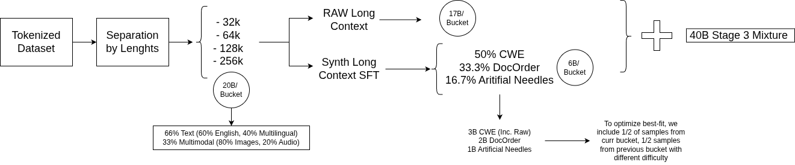

# LongContextQA

## Introduction
To improve the efficiency of retrieval, the firsts tasks that we are inserting into pre-training are:

1. [**Artificial needles**](https://arxiv.org/pdf/2406.19292): Large dictionary that teaches the model to retrieve information
2. [**CWE**](https://arxiv.org/pdf/2512.13961) (Common Words Extraction): Word counting, this allows the model to understand how many times a specific token appears.
3. **Document ordering**: Shuffle the input sequence and assign paragraph numbers, the task will consist on reaggrupating the paragraphs. You can increase the difficulty by splitting more the document. I haven’t found a related paper, but worth testing.

To improve packing efficiency, each task includes samples spanning a range of sequence lengths. For example, in the 64k context setting, samples range from 16k to 64k tokens. Within this range, shorter sequences (16k-32k) are treated with increased difficulty to balance training signal:

CWE
  * Hard: 10 QA pairs
  * Easy: 5 QA pairs
Document ordering
  * Hard: 8 shuffled sections
  * Easy: 4 shuffled sections

## Long Context Pipeline

The general pipeline can be described by the following diagram:

We first need to separate the available data into 3:
- Long Context Data (17B).
- Long Context Data for easy samples (1.5B).
- Long Context Data for hard samples (1.5B).

The 3B-token subset is used as the seed corpus for the synthetic tasks: CWE (3B tokens) and Document Ordering (2B tokens, reused with masking and shuffling). An additional 1B tokens are incorporated to further enrich the training mixture.

Firstly, you'll need to execute the bash script of `separation_script` and then the rest of the scripts accordingly.

## Future Work

- [MRCR data](https://arxiv.org/pdf/2409.12640v2). Not added for now given that it will require only training on the last turn (not supported in megatron-sft).
- Need for full document attention: Current planning explained [here](https://github.com/swiss-ai/apertus-program/issues/41).

## Warnings

- This repository is under development, the scripts also use Megatron-LM indexed dataset outputs given that I am mainly interested in pre-training for now, adapting the code to post training would require some time.